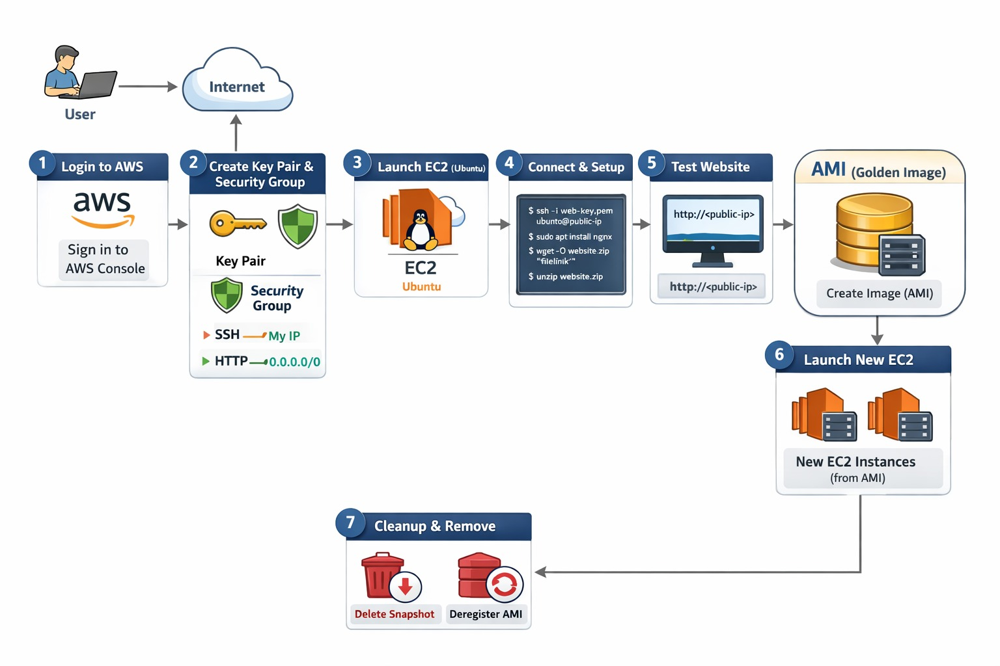

Creating AMI in AWS (Ubuntu + NGINX Website)


 WORKFLOW (High-Level)

```
Login → Launch Ubuntu EC2 → Install NGINX → Deploy Website
→ Verify using Public IP → Create AMI → Launch EC2 from AMI
→ Cleanup (Deregister AMI & Delete Snapshots)
```

---

STEP-BY-STEP WITH COMMANDS & EXPLANATION

---

Step 1: Login to AWS Console

    * Go to **[https://aws.amazon.com](https://aws.amazon.com)**
    * Sign in to **AWS Management Console**

Why?
To manage EC2 and AMI resources.

---

Step 2: Open EC2 Service

    * AWS Console → **EC2**
    * Go to **Instances**

---

Step 3: Launch EC2 Instance (Ubuntu)

    * Click **Launch Instance**
    * AMI: **Ubuntu 22.04 LTS**
    * Instance type: **t2.micro**
    * Key pair: Select/Create
    * Security Group:

    * SSH → 22 → My IP
    * HTTP → 80 → 0.0.0.0/0
    * Click **Launch**

**Why Ubuntu?**
Stable, lightweight, widely used for servers.

---

Step 4: Connect to Instance

    ```bash
    ssh -i key.pem ubuntu@<public-ip>
    ```

**Why?**
To configure the server.


Step 5: Check Present User

    ```bash
    whoami
    ```

Output:

```
ubuntu
```

---

Step 6: Check Directory

    ```bash
    pwd
    ```

---

Step 7: List Files

    ```bash
    ls
    ```

---

Step 8: Update System

    ```bash
    sudo apt update -y
    ```

Why?
Fetch latest package information.

---

Step 9: Install NGINX and ZIP

    ```bash
    sudo apt install nginx zip unzip -y
    ```

Start & enable NGINX:

    ```bash
    sudo systemctl start nginx
    sudo systemctl enable nginx
    ```
    or 
       -sudo apt update && sudo apt install  -y zip nginx

---

Step 10: Download Website ZIP File

    ```bash
    wget -O website.zip "filelink"
    ```

**Explanation:**
Downloads a file from the internet and saves it with a **custom name**.

---

Step 11: List Files

    ```bash
    ls
    ```

---

Step 12: Unzip the File

    ```bash
    unzip website.zip
    ```

---

Step 13: Copy Website Files to NGINX Root

    ```bash
    sudo cp -r website/* /var/www/html
    ```

Explanation:
Copies all website files to NGINX default directory.

---

Step 14: Verify Website

    * Copy **Public IP**
    * Open browser:

    ```
    http://<public-ip>
    ```

    ✅ Website should load

---

Step 15: Stop Instance (Best Practice)

    ```bash
    sudo shutdown now
    ```

Why?
Ensures data consistency while creating AMI.

---

Step 16: Create AMI

    * EC2 → Instances
    * Select instance
    * **Actions → Image and templates → Create image**
    * Image name: `ubuntu-nginx-website-ami`
    * Image description
    * Select **Snapshots**
    * Click **Create image**

---

Step 17: Launch Instance from AMI

    * EC2 → **AMIs**
    * Select created AMI
    * Click **Launch instance from AMI**

---

Step 18: Connect to New Instance

    ```bash
    ssh -i key.pem ubuntu@<new-public-ip>
    ```

    Check:

    ```bash
    systemctl status nginx
    ```

    Open browser → website loads without configuration ✅

---

Step 19: Deregister AMI & Delete Snapshot (Cleanup)

Deregister AMI:

    * EC2 → AMIs
    * Select AMI
    * **Actions → Deregister AMI**

 Delete Snapshot:

    * EC2 → Snapshots
    * Select snapshot
    * **Actions → Delete snapshot**

    **Why?**
    Avoid unnecessary AWS billing.

---

Step 20: Terminate Instance

    * EC2 → Instances
    * Select instance
    * **Instance state → Terminate**
    * Confirm termination
    * Wait for termination

Troubleshoot:
check nging status
    sudo systemctl status nginx
go to security check
    check HTTP port 80 SSH 22
    check website HTTP

INTERVIEW QUESTIONS & ANSWERS

1. What is an AMI?
An AMI is a **template** containing OS, software, and configurations to launch EC2 instances.

---

2. Why stop instance before creating AMI?
To avoid **data corruption** and ensure consistent snapshots.

---

3. What does AMI include?

* OS
* Installed software (NGINX)
* Website files
* EBS snapshots

---

4. Where are AMI snapshots stored?
In **Amazon EBS (backed by S3 internally)**.

---

5. Why use NGINX?
NGINX is **lightweight, fast, and scalable**.

---

6. Default NGINX website directory?
```
/var/www/html
```

---

7. Is AMI region-specific?
Yes, but it can be **copied to another region**.

---

8. Can AMI be used in Auto Scaling?
Yes, AMIs are commonly used in **Auto Scaling Groups**.

---

ONE-LINE PROJECT SUMMARY (Resume Ready)

> Hosted a static website on Ubuntu using NGINX, created a reusable AMI, and launched multiple EC2 instances from the preconfigured image.

---

Got it 👍
Below is a **professional, easy-to-understand, interview-ready write-up** of **what you did in this project**, written in a **clean corporate tone**, followed by **simple but professional interview questions & answers**.

You can use this for:

* **Resume**
* **GitHub README**
* **Interview explanation**
* **College / project review**

---

Project: AWS Infrastructure Automation using Ubuntu, NGINX & AMI

What I Did (Professional Explanation)

I designed and implemented a **cloud-based web hosting infrastructure on AWS** using an **Ubuntu EC2 instance**.
I installed and configured the **NGINX web server**, deployed a static website, and then created a custom Amazon Machine Image (AMI)** from the configured instance.

This AMI acts as a **golden image**, allowing me to quickly launch new EC2 instances with the same operating system, web server, and website already preconfigured.
The project demonstrates **infrastructure reusability, consistency, and scalability**, which are key principles in real-world DevOps and cloud environments.

---

Key Responsibilities Performed

* Launched and configured **Ubuntu EC2 instance** on AWS
* Installed and managed **NGINX web server**
* Deployed a static website to `/var/www/html`
* Verified application accessibility using **public IP**
* Created a **custom AMI (Golden Image)**
* Launched new EC2 instances from the AMI
* Performed **resource cleanup** to avoid unnecessary costs

---

Tools & Technologies Used

* **AWS EC2**
* **Amazon Machine Image (AMI)**
* **Amazon EBS Snapshots**
* **Ubuntu 22.04 LTS**
* **NGINX**
* **Linux (CLI)**
* **Git & GitHub**

---

Professional Project Workflow

```
AWS Console Login
→ Launch Ubuntu EC2
→ Install & Configure NGINX
→ Deploy Website
→ Verify via Public IP
→ Create Custom AMI
→ Launch EC2 from AMI
→ Cleanup Resources
```

---

Resume-Ready Project Description (Short)

> Built AWS infrastructure using Ubuntu EC2, hosted a static website with NGINX, created a reusable AMI (golden image), and launched multiple EC2 instances from the preconfigured image to ensure consistency and scalability.

---

Resume-Ready Project Description (Detailed)

> Designed and implemented AWS infrastructure by deploying an Ubuntu EC2 instance, configuring an NGINX web server, and hosting a static website. Created a reusable Amazon Machine Image (AMI) to standardize deployments and enable rapid provisioning of identical EC2 instances. Applied best practices for security, consistency, and cost optimization.

---

Interview Questions & Answers (Professional + Easy)

---

1. Can you explain your project briefly?

**Answer:**
I hosted a static website on an Ubuntu EC2 instance using NGINX and created a custom AMI from that instance. This AMI allows me to launch new EC2 instances with the same configuration, reducing setup time and ensuring consistency.

---

2. What is an AMI and why did you use it?

**Answer:**
An AMI is a template that contains the operating system, installed software, and configuration details. I used an AMI to create a reusable and standardized server image so that new EC2 instances can be launched quickly without manual configuration.

---

3. Why did you stop the EC2 instance before creating the AMI?

**Answer:**
Stopping the instance ensures data consistency and prevents file system corruption while AWS takes snapshots of the attached volumes.

---

4. What components are included in your AMI?

**Answer:**
The AMI includes:

* Ubuntu operating system
* NGINX web server
* Website files
* EBS snapshots of the instance volumes

---

5. Why did you choose NGINX?

**Answer:**
NGINX is lightweight, fast, and efficient. It is widely used in production environments for serving static content and handling high traffic.

---

6. Where are the website files stored on the server?

**Answer:**
The website files are stored in the default NGINX document root directory:

```
/var/www/html
```

---
7. Is an AMI region-specific?
Answer:
Yes, an AMI is region-specific, but it can be copied to other AWS regions if required.

---

8. How does this project help in real-world scenarios?

Answer:**
This approach is used in real environments to create golden images for Auto Scaling, disaster recovery, faster deployments, and maintaining consistent server configurations across teams.

---

9. Can this AMI be used with Auto Scaling?

Answer:
Yes, the AMI can be used as a launch template in an Auto Scaling Group to automatically scale EC2 instances based on demand.

---

10. How did you optimize costs in this project?
Answer:
After completing the work, I deregistered unused AMIs, deleted EBS snapshots, and terminated EC2 instances to avoid unnecessary AWS charges.

---

One-Line Interview Closing Statement

> This project demonstrates my understanding of AWS EC2, AMI creation, Linux server management, and real-world infrastructure reusability principles.

-- > OUTPUT


 ----------------------------------------


-----------------------------------------


----------------------------------------


----------------------------------------

