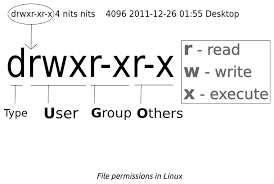
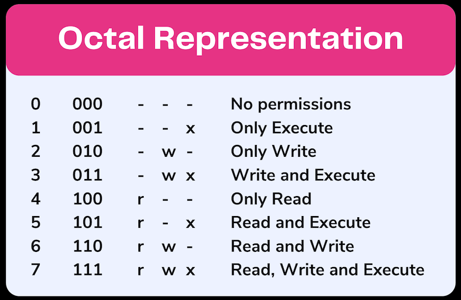

**--> Day 3 DevOps commands**
**System-level commands**
1. uname : is used to find the name of then system.
2. uptime : is used to find the uptime of the system
3. top : is used to find the top processes running on the system
4. who : is used to find the users logged into the system
5. whoami : is used to find the current user
6. w : is used to find the users logged into the system and what they are doing
7. free : is used to find the memory usage of the system
8. df : is used to find the disk space usage of the system
9. id : to check the user id and group id
10. SUDO : super user do used to execute the commands with root privileges
11. apt : is used to install the packages on the system
12. sudo apt-get "application name" :
13. sudo apt-get update : is used to update the package list
14. sudo apt-get upgrade : is used to upgrade the packages
15. yum : is used to install the packages on the system
16. sudo yum "application name" :
17. sudo yum update : is used to update the package list
18. sudo yum upgrade : is used to upgrade the packages
19. dnf : is used to install the packages on the system
20. sudo dnf "application name" :
21. sudo dnf update : is used to update the package list
22. sudo dnf upgrade : is used to upgrade the packages

**--> USER % GROUP MANAGEMENT COMMANDS
1.useradd : is used to create a new user
2. user -m username : is used to create a new user with no password
2. userdel : is used to delete a user
3. passwd : is used to change the password of a user
4. sudo :passesd : is used to change the password of a user
5. groupadd : is used to create a new group
6. groupdel : is used to delete a group
7. usermod : is used to modify a user'''
8. Su : is used to switch to the root user
9. sudo : is used to execute the commands with root privileges
10. sudo su : is used to switch to the root user and execute the commands with root privileges
11. sudo su - : is used to switch to the root user and execute the commands with root privileges and also load the root environment variables
12. cat/etc/passwd : is used to view the password file
13. cat /etc/group : is used to view the group file
14. cat /etc/shadow : is used to view the shadow file
15. sudo groupadd groupname : is used to create a new group
16. sudo groupdel groupname : is used to delete a group
17. sudo useradd -g groupname username : is used to create a new user in a group
18. sudo gpasswd -a username groupname : is used to add a user to a group
19. sudo gpasswd -d username groupname : is used to delete a user from a group
20. sudo passwd username : is used to change the password of a user
21. id username : is used to check the user id and group id of a user
22. groups username : is used to check the groups of a user
23. sudo usermod -aG groupname username : is used to add a user to a group
24. sudo usermod -G groupname username : is used to remove a user from a group
25. sudo chage -l username : is used to check the password expiry details of a user
26. sudo chage -E YYYY-MM-DD username : is used to set the account expiry date of a user
27. sudo chage -M days username : is used to set the maximum number of days a password is valid for a user
28. sudo chage -m days username : is used to set the minimum number of days a password is valid for
29. drwxrwxr-x : is used to check the permissions of a file or directory
    dr --> directory 
    - --> file
    r --> read
    w --> write
    x --> execute  (0-_), (--1)
    000(___) --> no permissions
    010 (_1_)--> read permission
    ls -l : is used to view the permissions of a file or directory
    chmod : is used to change the permissions of a file or directory
    chown : is used to change the owner of a file or directory
    chgrp : is used to change the group of a file or directory
    sudo chmod permissions filename : is used to change the permissions of a file or directory
    sudo chown owner filename : is used to change the owner of a file or directory


Understood. Below is a **pure `.md` (Markdown) file**.
You can **directly copy–paste this into a `.md` file** (for example: `day3-devops-commands.md`) and push it to GitHub.

No extra text outside Markdown.

---

````md
# Day 3 – DevOps Linux Commands

This document explains **System-Level Commands** and **User & Group Management Commands** with **real-world DevOps examples**.  
Language is simple and beginner-friendly.

---

## System-Level Commands

### 1. `uname`
Used to find system and kernel information.

**Examples:**
```bash
uname
````

Shows the OS name (used to confirm Linux system).

```bash
uname -a
```

Used by DevOps engineers to check kernel version during troubleshooting.

---

### 2. `uptime`

Used to find how long the system has been running.

**Examples:**

```bash
uptime
```

Used to verify if a server restarted unexpectedly.

```bash
uptime -p
```

Used in reports to show readable uptime.

---

### 3. `top`

Used to display running processes and system usage.

**Examples:**

```bash
top
```

Used to find high CPU or memory usage.

```bash
top -u root
```

Used to monitor root-owned processes.

---

### 4. `who`

Used to find users logged into the system.

**Examples:**

```bash
who
```

Used on shared servers to check active users.

```bash
who -H
```

Shows output with headers.

---

### 5. `whoami`

Used to find the current user.

**Examples:**

```bash
whoami
```

Used to confirm the logged-in user.

```bash
sudo whoami
```

Confirms root access.

---

### 6. `w`

Shows logged-in users and their activities.

**Examples:**

```bash
w
```

Used to monitor system usage.

```bash
w username
```

Used to check a specific user's activity.

---

### 7. `free`

Used to check memory usage.

**Examples:**

```bash
free
```

Used to check available RAM.

```bash
free -h
```

Used for human-readable output.

---

### 8. `df`

Used to check disk usage.

**Examples:**

```bash
df
```

Used to check mounted disk usage.

```bash
df -h
```

Used during storage alerts.

---

### 9. `id`

Used to check user ID and group ID.

**Examples:**

```bash
id
```

Used to verify current user permissions.

```bash
id username
```

Used to check another user's access.

---

### 10. `sudo`

Used to execute commands with root privileges.

**Examples:**

```bash
sudo reboot
```

Used to restart a server.

```bash
sudo systemctl restart nginx
```

Used to restart services.

---

### 11. `apt`

Used to install packages (Ubuntu/Debian).

**Examples:**

```bash
sudo apt install git
```

```bash
sudo apt remove nginx
```

---

### 12. `apt-get update`

Used to update the package list.

**Examples:**

```bash
sudo apt-get update
```

```bash
sudo apt-get update && sudo apt-get upgrade
```

---

### 13. `apt-get upgrade`

Used to upgrade installed packages.

**Examples:**

```bash
sudo apt-get upgrade
```

```bash
sudo apt-get upgrade -y
```

---

### 14. `yum`

Used to install packages (CentOS/RHEL).

**Examples:**

```bash
sudo yum install httpd
```

```bash
sudo yum remove httpd
```

---

### 15. `dnf`

Modern package manager for RHEL-based systems.

**Examples:**

```bash
sudo dnf install docker
```

```bash
sudo dnf update
```

---

## User & Group Management Commands

### 1. `useradd`

Used to create a new user.

**Examples:**

```bash
sudo useradd devuser
```

```bash
sudo useradd -m devuser
```

---

### 2. `userdel`

Used to delete a user.

**Examples:**

```bash
sudo userdel devuser
```

```bash
sudo userdel -r devuser
```

---

### 3. `passwd`

Used to change a user's password.

**Examples:**

```bash
passwd
```

```bash
sudo passwd username
```

---

### 4. `groupadd`

Used to create a group.

**Examples:**

```bash
sudo groupadd devops
```

```bash
sudo groupadd developers
```

---

### 5. `groupdel`

Used to delete a group.

**Examples:**

```bash
sudo groupdel devops
```

```bash
sudo groupdel testgroup
```

---

### 6. `usermod`

Used to modify user settings.

**Examples:**

```bash
sudo usermod -aG devops username
```

```bash
sudo usermod -s /bin/bash username
```

---

### 7. `su`

Used to switch users.

**Examples:**

```bash
su root
```

```bash
su username
```

---

### 8. `sudo su`

Used to switch to root user.

**Examples:**

```bash
sudo su
```

```bash
sudo su -
```

---

### 9. `/etc/passwd`

Used to view user account details.

**Examples:**

```bash
cat /etc/passwd
```

```bash
grep username /etc/passwd
```

---

### 10. `/etc/group`

Used to view group details.

**Examples:**

```bash
cat /etc/group
```

```bash
grep devops /etc/group
```

---

### 11. File Permissions (`drwxrwxr-x`)

Used to understand file permissions.

**Meaning:**

* `d` → directory
* `r` → read
* `w` → write
* `x` → execute

**Examples:**

```bash
ls -l
```

```bash
chmod 755 filename
```

---

### 12. `chmod`

Used to change permissions.

**Examples:**

```bash
chmod 777 file.txt
```

```bash
sudo chmod 644 file.txt
```

---

### 13. `chown`

Used to change file owner.

**Examples:**

```bash
sudo chown user file.txt
```

```bash
sudo chown user:group file.txt
```

---

### 14. `chgrp`

Used to change group ownership.

**Examples:**

```bash
sudo chgrp devops file.txt
```

```bash
sudo chgrp developers directory/
```

---

## End of Day 3 – DevOps Commands

```

---

If you want, I can:
- Split this into **multiple `.md` files**
- Add **practice tasks**
- Add **interview questions**
- Convert this into a **30-day DevOps GitHub repo structure**

Just tell me.
```
